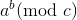

#ModRecExp
Recursive Python algorithm for modular exponentiation.

Optimizes the evaluation of statements of the form
 by reducing using Euler's Theorem.

Designed for speeding up calculations in the case of large inputs.  It will not speed up calculations for inputs less than ~25.

Merely an algorithm. No installation required.